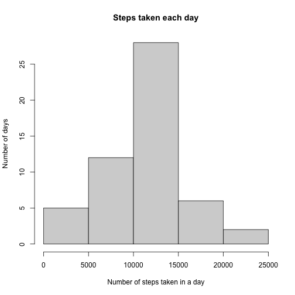
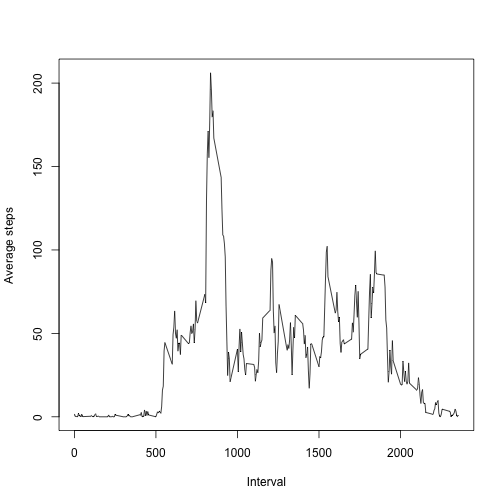
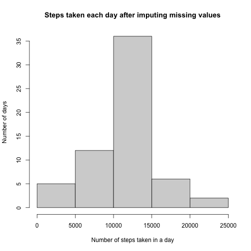
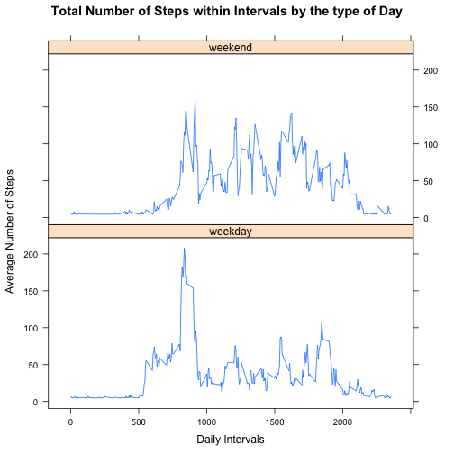

## Loading and preprocessing the data

The Dataset for this Assignment is located in the file repository labeled as **activity.zip** and it can be also downloadabel from [this link](https://d396qusza40orc.cloudfront.net/repdata%2Fdata%2Factivity.zip).

The data is now loaded into R and the **date** column is formated into Date type in r with this code snippet.


```r
if (!file.exists("activity.zip")) {
  download.file("https://d396qusza40orc.cloudfront.net/repdata%2Fdata%2Factivity.zip", destfile = "activity.zip", method = "curl")
}
if (!file.exists("activity.csv")) {
  unzip("activity.zip")
}

data <- read.csv("activity.csv")
data$date <- as.Date(data$date, "%Y-%m-%d")
head(data)
```

```
##   steps       date interval
## 1    NA 2012-10-01        0
## 2    NA 2012-10-01        5
## 3    NA 2012-10-01       10
## 4    NA 2012-10-01       15
## 5    NA 2012-10-01       20
## 6    NA 2012-10-01       25
```

## What is mean total number of steps taken per day?
At first I have aggregated the steps column according to date.

```r
plot1data <- aggregate(steps ~ date, data, sum)
```

1. I have drawn a Histogram of total steps taken each day.

```r
hist(plot1data$steps, xlab = "Number of steps taken in a day", ylab = "Number of days", main = "Steps taken each day")
```



2. Now I have calculated the **mean** and **median** of the *steps*.

```r
mean(plot1data$steps, na.rm = TRUE)
```

```
## [1] 10766.19
```


```r
median(plot1data$steps, na.rm = TRUE)
```

```
## [1] 10765
```


## What is the average daily activity pattern?
At first I have aggregated the dataset with the mean of **steps** for each 5 minute interval.

```r
plot2data <- aggregate(steps ~ interval, data, mean)
```

1. I have plotted a time series graph between 5-minute interval (x-axis) and the average number of steps taken in the interval for all days(y-axis).

```r
plot(plot2data$interval, plot2data$steps, type = "l", main = "", xlab = "Interval", ylab = "Average steps")
```



2. The 5-minute interval, on average across all the days in the dataset, contains the maximum number of steps is determined.

```r
plot2data[plot2data$steps == max(plot2data$steps), 1]
```

```
## [1] 835
```


## Imputing missing values
In the Dataset some of days/intervals where there are missing values (coded as NA). The presence of missing days may introduce bias into some calculations or summaries of the data.

1. Calculate and report the total number of missing values in the dataset.

```r
missingCount <- sum(!complete.cases(data))
```

There are 2304 missing values in the dataset.

2. Devise a strategy for filling in all of the missing values in the dataset.
* I decided to fill the *Na*'s int the steps with the mean of the column steps.

```r
calculatedMean <- mean(data$steps, na.rm = TRUE)
```

The mean of the column **steps** is 37.3825996.

3. Create a new dataset that is equal to the original dataset but with the missing data filled in.

* After replacing the *Na*'s with the *mean* we get:

```r
data[is.na(data$steps), 1] <- calculatedMean
head(data)
```

```
##     steps       date interval
## 1 37.3826 2012-10-01        0
## 2 37.3826 2012-10-01        5
## 3 37.3826 2012-10-01       10
## 4 37.3826 2012-10-01       15
## 5 37.3826 2012-10-01       20
## 6 37.3826 2012-10-01       25
```

4. 

At first I have aggregated the steps column according to date.

```r
plot1data <- aggregate(steps ~ date, data, sum)
```

1. I have drawn a Histogram of total steps taken each day.

```r
hist(plot1data$steps, xlab = "Number of steps taken in a day", ylab = "Number of days", main = "Steps taken each day after imputing missing values")
```



2. Now I have calculated the **mean** and **median** of the *steps*.

```r
mean(plot1data$steps)
```

```
## [1] 10766.19
```


```r
median(plot1data$steps)
```

```
## [1] 10766.19
```

Since I imputed the missing values by the mean number of steps per interval, there is no difference in mean before and after imputing that is not surprising. The median has changed a little bit.

## Are there differences in activity patterns between weekdays and weekends?
Mandatory import.

```r
library(dplyr)
library(lattice)
```

1. Create a new factor variable in the dataset with two levels – “weekday” and “weekend” indicating whether a given date is a weekday or weekend day.

```r
modifiedData <- data %>%
  mutate(day = ifelse(weekdays(date) == "Sunday" | weekdays(date) == "Saturday", "weekend", "weekday"))
head(modifiedData)
```

```
##     steps       date interval     day
## 1 37.3826 2012-10-01        0 weekday
## 2 37.3826 2012-10-01        5 weekday
## 3 37.3826 2012-10-01       10 weekday
## 4 37.3826 2012-10-01       15 weekday
## 5 37.3826 2012-10-01       20 weekday
## 6 37.3826 2012-10-01       25 weekday
```

2. Make a panel plot containing a time series plot (i.e. type = "l") of the 5-minute interval (x-axis) and the average number of steps taken, averaged across all weekday days or weekend days (y-axis).


```r
plot3data <- modifiedData %>% group_by(day, interval) %>%
  summarize(averageSteps = mean(steps))
```

```
## `summarise()` has grouped output by 'day'. You can override using the `.groups` argument.
```

```r
with(plot3data, 
      xyplot(averageSteps ~ interval | day, 
      type = "l",      
      main = "Total Number of Steps within Intervals by the type of Day",
      xlab = "Daily Intervals",
      ylab = "Average Number of Steps",
      layout = c(1,2)))
```




